# python-api-challenge

# Part I - WeatherPy

## Scatter Plots

### Temperature (F) vs. Latitude

| Plot                                                               | Observation                                                                                                                                                                                                                                                               |
| ------------------------------------------------------------------ | ------------------------------------------------------------------------------------------------------------------------------------------------------------------------------------------------------------------------------------------------------------------------- |
| 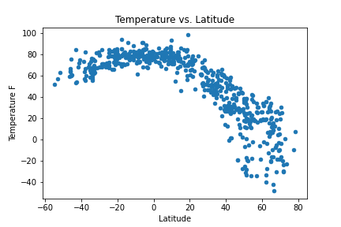 | 1. In north hemisphere, it is obvious that the temperature drop when latitude increase.   2. In South hemisphere, the chart doesn't show obvious relationship between temperature and latitude  3. there are very less cities picked between latitude -40 ~ -80. |

### Humidity (%) vs. Latitude

| Observation                                                    | Plot                                                                |
| -------------------------------------------------------------- | ------------------------------------------------------------------- |
| There isn't obvious relationship between humidity and latitude | 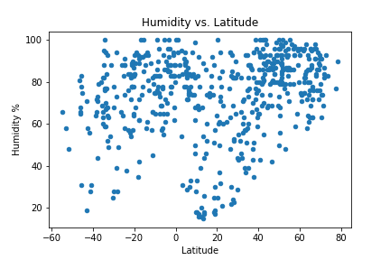 |

### Cloudiness (%) vs. Latitude

| Plot                                                                    | Observation                                                      |
| ----------------------------------------------------------------------- | ---------------------------------------------------------------- |
| 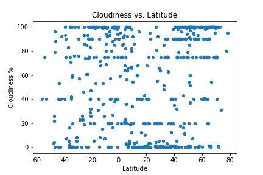 | There isn't obvious relationship between cloudiness and latitude |

### Wind Speed (mph) vs. Latitude

| Observation                                                      | Plot                                                          |
| ---------------------------------------------------------------- | ------------------------------------------------------------- |
| There isn't obvious relationship between wind speed and latitude | 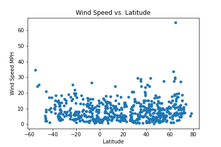 |

## Linear Regression

### Temperature (F) vs. Latitude

- plot
  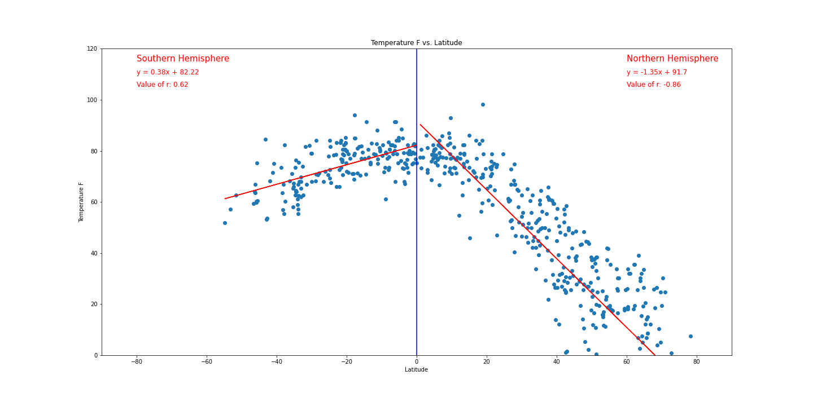
- Observation
  - Northern Hemisphere
    - rvalue is -0.87. The absolute value is greater than 0.7
    - Temperature and Latitude has strong correlation
    - Temperature drops when Latitude in Northern Hemisphere increase
  - Southern Hemisphere
    - rvalue is 0.52. The absolute value is greater than 0.5 and less then 0.7
    - Temperature and Latitude has moderate correlation
    - Notice that there is less cities when latitude is from -40 to -80

### Humidity (%) vs. Latitude

- plot
  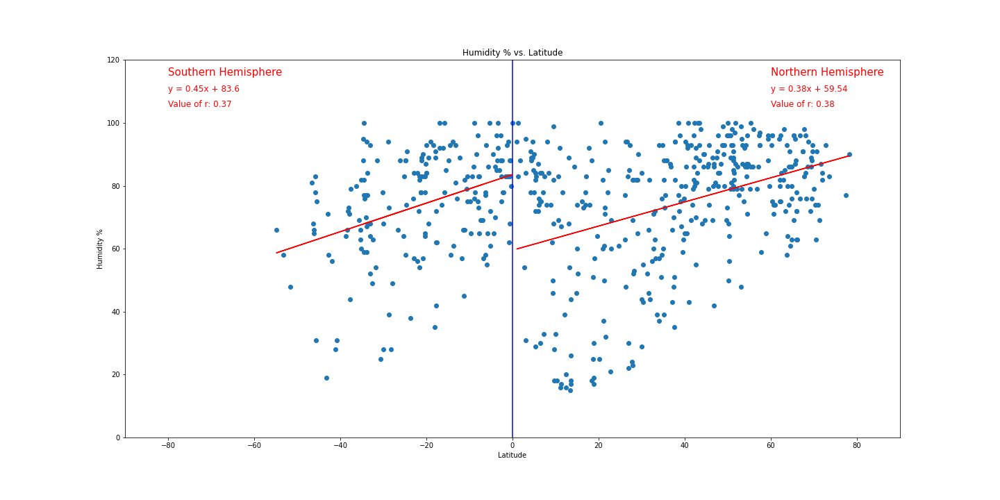
- Observation
  - Northern Hemisphere
    - rvalue is 0.41. The absolute value is less than 0.5 and greater than 0.3.
    - Humidity and Latitude has weak correlation
  - Southern Hemisphere
    - rvalue is 0.26. The absolute value is less than 0.3.
    - Humidity and Latitude has none or very weak correlation

### Cloudiness (%) vs. Latitude

- plot
  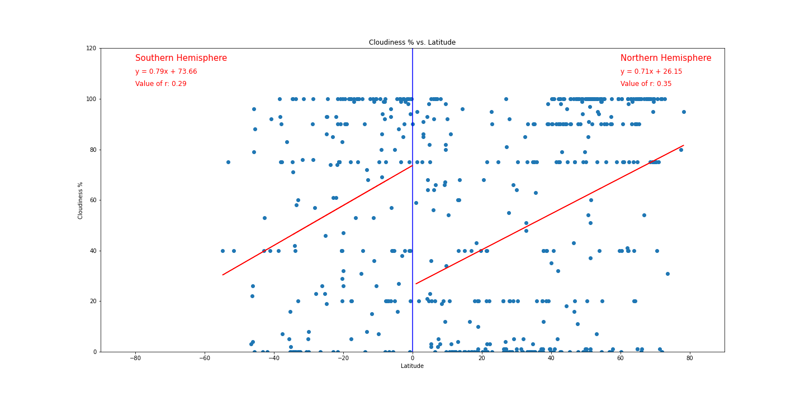
- Observation
  - Northern Hemisphere
    - rvalue is 0.39. The absolute value is greater than 0.3 and less than 0.5
    - Cloudiness and Latitude has weak correlation
  - Southern Hemisphere
    - rvalue is 0.22. The absolute value is less then 0.3
    - Cloudiness and Latitude has none or very weak correlation### Wind Speed (mph) vs. Latitude

### Wind Speed (mph) vs. Latitude

- plot
  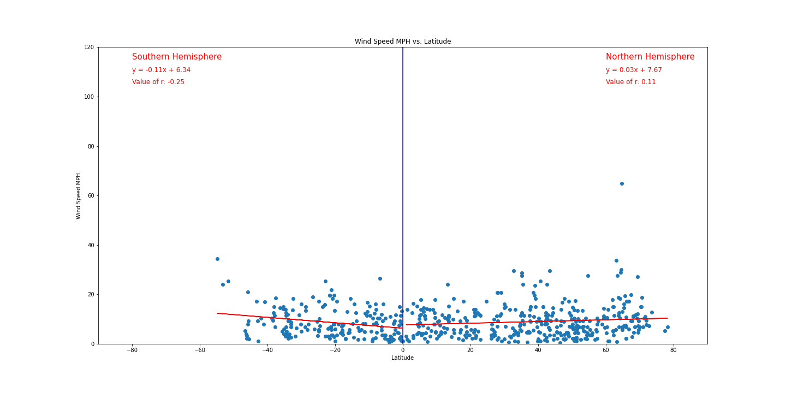
- Observation
  - Northern Hemisphere
    - rvalue is 0.0.
    - Wind speed and Latitude has none correlation
  - Southern Hemisphere
    - rvalue is -0.14.
    - Wind speed and Latitude has none correlation

# Part II - VacationPy

## A heat map that displays the humidity for every city from Part I

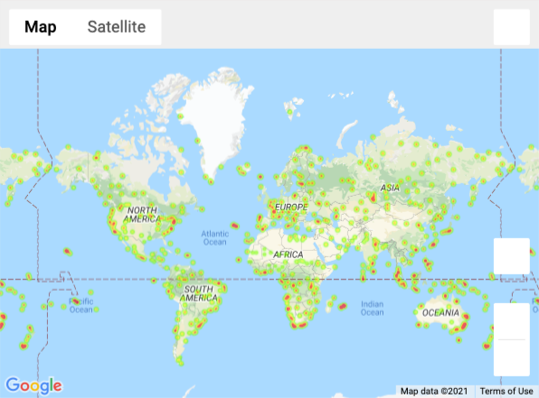

## Adeal weather cities heat map

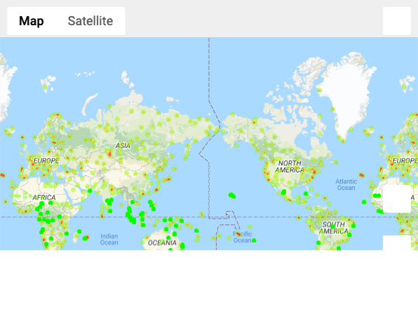

## Ideal weather cities marker on heat map

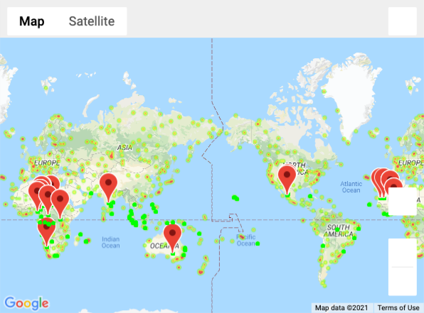

## Ideal weather heatmap with each pin containing the Hotel Name, City, and Country.

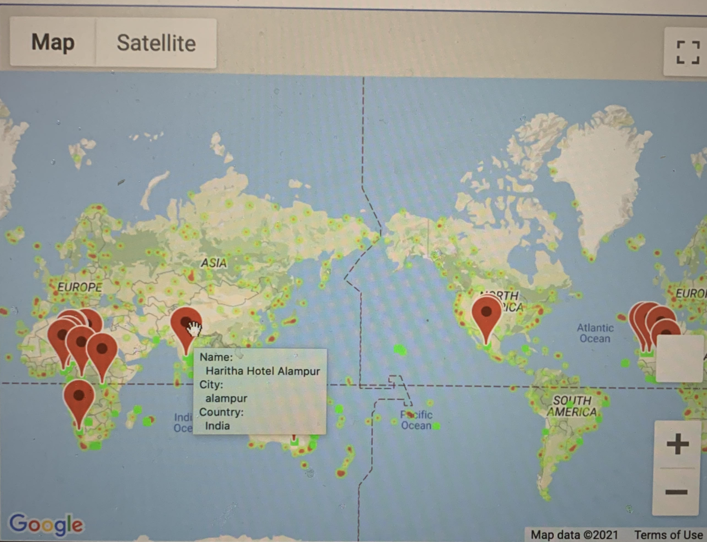
